<div align="center">



# 🪰 Fly-Delity: 1930s Rubber Hose Noir Connectome Music Rater

[](https://flywire.ai/)
[](https://github.com/Rahul-A-2111/FlyWire-Connectome-Music-Rater)
[](https://github.com/Rahul-A-2111/FlyWire-Connectome-Music-Rater)
[](https://github.com/Rahul-A-2111/FlyWire-Connectome-Music-Rater)
[](https://github.com/Rahul-A-2111/FlyWire-Connectome-Music-Rater)
[](https://github.com/Rahul-A-2111/FlyWire-Connectome-Music-Rater)

<p align="center">
  <b>A real connectome neural simulation where a 1930s cartoon fruit fly rates your music.</b><br/>
  Powered by the complete FlyWire <i>Drosophila melanogaster</i> brain map and Leaky Integrate-and-Fire (LIF) network modeling.
</p>

---

</div>

## 📖 Overview

> [!NOTE]
> **What is Fly-Delity?**  
> Fly-Delity is an interactive sound rater. It simulates how a fruit fly hears and reacts to human songs. The application uses authentic synaptic wiring data from the **FlyWire Connectome Project**. Everything is wrapped in a 1930s vintage film reel aesthetic hosted by our gentleman critic, **Lord Drosophila, Esq.**

In nature, fruit flies communicate through delicate wing vibrations called courtship songs. Their antennal ears (known as **Johnston's Organ**) contain tiny mechanoreceptor neurons that detect acoustic frequencies and pulse rhythms. 

When you play a song, Fly-Delity converts the audio waveform into synaptic current. It streams these currents through thousands of simulated neurons in real time. The fly's brain then decides if your music is a romantic masterpiece, a battle rhythm, or chaotic noise that triggers its emergency escape reflexes.

---

## 🎨 White, Blue & Red Neural Modes

The fly brain evaluates audio under three distinct behavioral mindsets:

| Mode | Circuit Accent | Target Frequencies | Behavioral Goal |
| :--- | :---: | :--- | :--- |
| 🔵 **Courtship Mode** | **Royal Blue** | 120–160 BPM pulse rhythms, 180 Hz sine hums | The fly seeks romance. Activates P1/pIP10 wing extension command circuits. |
| 🔴 **Territorial Mode** | **Crimson Red** | Heavy transients, fast tempo strikes, percussive force | The fly defends its fruit platter. Stimulates fight-or-flight thoracic motor units. |
| ⚪ **Quiet / Sleep Mode** | **Crisp White** | Low decibels, gentle harmonics, tranquil ambient drift | The fly rests. Sudden loud noises trigger violent awakening and night-terror panic. |

> [!IMPORTANT]
> **Mode Locking During Bio-Scan**:  
> Once an audio scan begins, the behavioral mode selector is locked with a glowing indicator badge. This prevents network state corruption while the LIF simulation is running.

---

## ⚡ Core Features

### 1. 🎛️ Unified Typebar Console
- **Single Seamless Bar**: You do not have to jump between different UI boxes. Both local file uploads and online archive searches share the exact same pill-shaped typebar console.
- **Dynamic Prompt Switch**:
  - In **Upload Mode**: The bar prompts `Drag & drop audio file or click to upload (.mp3, .wav, .m4a)...` with a microphone icon and an upload arrow.
  - In **Online Search Mode**: The prompt smoothly becomes an active search input: `Enter artist or song name to search online archives (e.g. Daft Punk, Queen)...` with a magnifying glass.
- **Quick Controls**:
  - Quick demo buttons for instant testing (*Daft Punk* or *Discordant Screech*).
  - Fast suggestion chips for famous jazz, classical, and electronic legends (*Cab Calloway*, *Duke Ellington*, *Miles Davis*, *Queen*).

---

### 2. 🎬 Theatrical Video Reaction & Scorecard Synchronization
- **Immediate Disappearance of Popups**: When you click **SEE RESULTS**, the preliminary modal box disappears instantly (`display: none`). It will never block or play behind your view.
- **Projector Viewport Centering**: The 1930s film reel smoothly scrolls right to the center of your screen.
- **Full Video Experience**: The custom cartoon reaction video (`fly_good.mp4` or `fly_bad.mp4`) plays with full sound front-and-center.
- **Event-Driven Slide-Up**: The 5-gauge neural scorecard **only slides up after the video clip finishes playing**. The comedic punchline is never cut short.
- **Skip Control**: A dedicated `SKIP TO REPORT ➔` button is available if you want to inspect the numbers right away.

---

### 3. 🏆 Real-Time Connectome Hall of Acclaim (Leaderboard)
- **Instant Live Dispatch**: Audited songs are immediately added to the top of the leaderboard in real time without refreshing the page.
- **Live Audit Feed Banner**: In the *All Categories* view, a live stream banner (`⚡ LIVE AUDIT LOG // REAL-TIME DISPATCH`) dynamically highlights the latest specimens.
- **Glow Highlights**: Your newly rated track is styled with a glowing gold border and an animated `★ JUST AUDITED` badge.
- **Direct Scorecard Jump**: Click `★ VIEW ON LEADERBOARD ➔` on the scorecard to glide straight down to your track's entry in the ledger.
- **Category Filters**:
  - 🔵 `★ All-Time Affinity`: High-scoring dipteran auditory gems ($\ge 75$).
  - 🔵 `♫ Courtship Harmonics`: Tracks certified under Courtship mode.
  - 🔴 `⚡ Johnston's Vibration`: Battle tracks evaluated under Territorial mode.
  - ⚪ `☾ Nocturnal Slumber`: Peaceful bedtime tracks evaluated under Sleep mode.
  - 🔴 `⚠ Dreadful Swatter Triggers`: Disastrous cacophony that triggers fly panic ($< 55$).
  - 🕒 `Recent Audits`: Fast chronological filter for the latest entries.

---

### 4. 🌐 Online Global Song Search & Preview
- **Millions of Songs**: Search any track or artist using the public iTunes Search API. No API key required.
- **30-Second Preview Player**: Audition any song with the built-in vintage preview player before running a bio-scan.
- **1-Click Audit**: Click `AUDIT ➔` to download, convert to a 16 kHz mono WAV file via FFmpeg, and stream directly into the connectome simulator.

---

## 🏆 15 Customized Verdicts (3 Modes × 5 Tiers)

Every audit receives a custom rank badge, verdict headline, and critical commentary written in vintage 1930s prose:

| Score Tier | Rank Badge | Courtship Mode 🔵 | Territorial Mode 🔴 | Quiet / Sleep Mode ⚪ |
| :---: | :---: | :--- | :--- | :--- |
| **85.0 – 100.0** | **Rank S+** | 🔵 **True Romantic Sync**<br/>Single wing extended at 180 Hz with unbridled romance. | 🔴 **Apex Warrior Shock**<br/>Dominion over the rotting banana throne is secured. | ⚪ **Velvet Lullaby**<br/>Total circadian tranquility; sweet dreams in the sugar dish. |
| **70.0 – 84.9** | **Rank A** | 🔵 **Enchanted Flutter**<br/>Handsome serenade; polite abdominal waggle granted. | 🔴 **Aggressive Spar**<br/>Rival flies retreat across the perimeter in respect. | ⚪ **Gentle Slumber**<br/>Peaceful dreamland; dorsal vessel pulses rhythmically. |
| **50.0 – 69.9** | **Rank B** | ⚪ **Lukewarm Hover**<br/>Suitor stumbles like a tipsy gentleman in a speakeasy. | ⚪ **Mild Skirmish**<br/>Cautious standoff; neither fruit won nor honor lost. | ⚪ **Restless Twitch**<br/>Tarsal claw twitching; light slumber disturbed. |
| **30.0 – 49.9** | **Rank C** | 🔴 **Discordant Rejection**<br/>Erratic frequency clashes; antenna grooming in horror. | 🔴 **Territory Surrendered**<br/>Feeble meekness; chased off the fruit platter without a fight. | 🔴 **Rude Awakening**<br/>Cacophony triggers a groggy fall from the hammock. |
| **0.0 – 29.9** | **Rank F** | 🔴 **Swatter Divorce**<br/>Acute courtship paralysis; bring the swatter and end it. | 🔴 **Routed Retreat**<br/>Giant Fiber panic; flying backward directly into a wall. | 🔴 **Nightmare Siren**<br/>Violent awakening terror; launched out of hammock in agony. |

---

## 🔬 How the Connectome Biology Works

```
   [ Audio Waveform (.mp3 / .wav) ]
                  │
                  ▼
  [ Johnston's Organ Mechanoreceptors ]
         ├── JO-A/B: High-frequency sensitive (120 - 250 Hz Sine)
         └── JO-C/E: Low-frequency / transient vibration sensitive
                  │
                  ▼
   [ Leaky Integrate-and-Fire Network ]
         ├── Signed Synapses (AMPA / GABA / Acetylcholine)
         ├── P1 & pIP10: Male Courtship Command Neurons
         └── LC4 & Giant Fiber: Visual / Acoustic Escape Neurons
                  │
                  ▼
     [ 5 Real-Time Telemetry Gauges ]
         1. 🔵 JO-AB Resonance (% harmonic lock)
         2. 🔵 Courtship Pulse (% wing extension sync)
         3. 🔴 Flight Motor Stim. (% thoracic vibration burst)
         4. 🔴 Swatter Threat (% LC4 giant fiber escape trigger)
         5. ⚪ Dopamine Surge (Mushroom body reward multiplier)
```

> [!CAUTION]
> **Swatter Hazard Alert**:  
> Harsh screeches and erratic noise over-stimulate the Giant Fiber interneurons. When the Swatter Escape gauge exceeds **50%**, the fly panics, rejects the track, and triggers the `fly_bad.mp4` reaction reel!

---

## 📂 Project Structure

```text
flywire-song-project/
├── app.py                     # Flask web app, SSE stream pipeline, search & leaderboard APIs
├── judge_engine.py            # Connectome simulation, 3-mode scoring, and 15 verdict engines
├── audio_utils.py             # Audio-to-current conversion, IPI pulse sync, and tempo analysis
├── cave.py                    # FlyWire synapse matrices and LIF neural network simulator
├── leaderboard.json           # Persistent JSON storage for all certified audit specimens
├── jon_synapses.csv           # Cached FlyWire synapse data
├── neuron_annotations.csv     # Cached FlyWire cell-type annotations
├── static/
│   ├── readme_banner.svg      # White, Blue, and Red 1930s Noir header banner
│   ├── fly_hero.png           # Idle Lord Drosophila portrait under the spotlight
│   ├── fly_good.mp4           # 10s vintage cartoon reaction: fly grooving on tempo
│   ├── fly_bad.mp4            # 15s vintage cartoon reaction: fly in agony from bad music
│   ├── daft_demo.wav          # Clean 128 BPM electronic courtship preset
│   └── screech_demo.wav       # Harsh discordant swatter hazard preset
└── uploads/                   # Temporary buffer for audio processing
```

---

## 🚀 Setup & Installation

### 1. Prerequisites
- **Python 3.10+**
- **FFmpeg** installed and accessible on your system PATH (required for audio conversion).

### 2. Activate Your Environment
If you are using the virtual environment:

```powershell
# In PowerShell:
C:\Users\rahul_o2332zg\flywire_env\Scripts\Activate.ps1
```

Or install requirements in your environment:

```powershell
python -m pip install flask flask-cors caveclient librosa numpy scipy soundfile pandas
```

Verify CAVEclient:

```powershell
python -c "import caveclient; print(caveclient.__version__)"
```

---

## 🎮 How to Run the App

1. **Start the local server**:
   ```powershell
   python app.py
   ```

2. **Open your browser**:
   Navigate to [http://localhost:5000](http://localhost:5000).

3. **Choose a Behavioral Mode**:
   Select **♫ Courtship**, **⚡ Territorial**, or **☾ Quiet / Sleep**.

4. **Pick Your Music**:
   - **Upload Mode**: Drop an audio file onto the typebar console or click a Quick Demo.
   - **Search Mode**: Click `🌐 Search Archives Online` and type an artist or track name directly in the same bar.

5. **Step Into the Screening Booth**:
   - Watch the live mechanoreceptor scan.
   - When finished, click the **SEE RESULTS ➔** button.
   - The popup vanishes instantly, the film centers on screen, and the reaction cartoon plays.

6. **Review Your Verdict & Leaderboard**:
   - After the video clip ends, your 5-gauge scorecard slides up.
   - Click `★ VIEW ON LEADERBOARD ➔` to see your track ranked and glowing in real time!
   - Click `✦ RATE ANOTHER SONG ✦` anytime or click any archived entry to immediately audition another track.

---

<div align="center">

**Drosophila Biosonic Sound Laboratories • Circa 1934**  
*Certified by Lord Drosophila, Esq. // 139,255 Synapses Audited*

</div>
